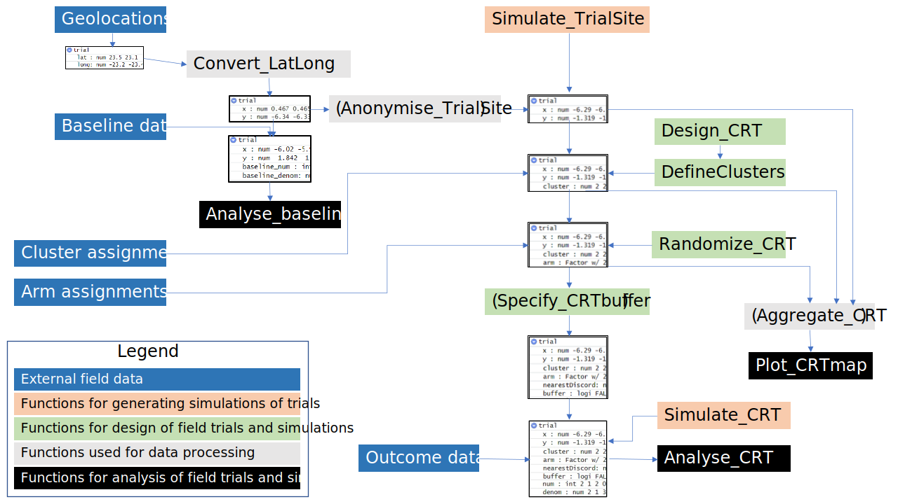

<!--To build the vignette first Knit and then use:
rmarkdown.html_vignette.check_title = FALSE 
devtools::install(build_vignettes = TRUE)
--> 
## Summary

The `CRTspillover` package is intended to support the design and analysis of cluster-randomized trials (CRTs) where there is geographical contamination between the arms. It can also be used in simulation of such CRTs to support development of improved methodology. An important set of applications is in field trials of vector-control interventions against malaria.

The package can facilitate design of efficent trials by providing algorithms for: 
+ algorithmic assignment of clusters (and buffer zones) 
+ analysis of the effects of spill-over 
+ simulation of trials based on the geography of previously studied field sites and trials, and observed spatial patterns of outcomes, or on geographical information from novel sites.

The methods are described in the papers [Multerer *et al.* (2021a)](https://trialsjournal.biomedcentral.com/articles/10.1186/s13063-021-05543-8) and [Multerer *et al.* (2021b)](https://malariajournal.biomedcentral.com/articles/10.1186/s12936-021-03924-7).  

##  Anticipated use cases 

+ Algorithmic definition of clusters and of buffer zones (if required)
+ Simulation of trials (for evaluating power and testing methods)
+ Determination of optimal cluster size 
+ Determining the effects of different sizes of buffer zones 
+ Estimation of intracluster correlations (ICC), contamination ranges and efficacy  
+ Power and sample size calculations allowing for contamination
+ Anonymising input locations (if required for sharing reference datasets).

##  Package functions 

The package functions are as follows:

| Function name | Purpose | Pre-requirements | Outputs |
|-------------------:|:---------------|---------------|:--------------------:|
|_Simulate_TrialSite()_|creation of simulated locations|no pre-existing trial|locations in x,y format (columns 'x','y')|
|_Convert_LatLong_|conversion of latlong geolocations to cartesian coordinates|geolocations in lat-long |locations in x,y format (columns 'x','y')| 
|_Anonymise_TrialSite()_|anonymisation of locations (while preserving distances)|locations in x,y format (columns 'x','y') |locations in x,y format (columns 'x','y')| 
|_Design_CRT()_|determination of required number of clusters|locations in x,y format (columns 'x','y') | Estimated minimum number of clusters; Cluster assignments|
|_DefineClusters()_|algorithmic assignment of clusters|locations in x,y format (columns 'x','y') |assignment of clusters (column 'cluster')|
|_Randomize_CRT()_|randomization|assignment of clusters (column 'cluster')|assignment of arms (column 'arm')|
|_Simulate_CRT()_|simulation of outcomes|cluster and arm assignments|simulated proportions by record|
|_Specify_CRTbuffer_|specification of buffer zones |assignment of arms (column 'arm')|assignment of buffer (column 'buffer')|
|_Aggregate_CRT()_|aggregation of records by location |outcome (proportion) by record|proportions by unique location|
|_Plot_CRTmap()_|mapping of locations, clusters, arms|unique locations|maps of locations and assignments|
|_Analyse_baseline()_|description of baseline data and estimation of ICC|outcome (proportion) by record|statistical analysis|
|_Analyse_CRT()_|standard analyses of efficacy and range of contamination|outcome (proportion) by record; cluster and arm assignments|statistical analysis, outputs depend on choice of method|

For details of the additional parameters required on input and of the outputs, see the documentation under each function. The term 'record' refers to the rows in the dataframe, which often, but not always, correspond to unique locations.

## General Workflow

The use of the package starts with selection of a set of locations.  These may be derived from a field site, or if the objective is a generic evaluation of methods, simulated locations can be used, most straightforwardly by generating them using `Simulate_TrialSite()`. The dataframe containing the locations is then incrementally augmented with clusters, arms, and trial outcomes (working through Figure 1 from top to bottom, see below). At each stage the augmentation can use either existing data from field trials or pre-determined values (blue boxes in Figure 1), or can be automated using the package functions (green boxes in Figure 1). The analysis routines in the package can be used to inform the choice of parameters, by quantifying degree of contamination between arms, required numbers of clusters, statistical power etc.. 

_Figure 1. Workflow_

{ width=100% }
(functions in brackets represent optional steps)

<!--You can also embed plots, for example:

```{r pressure, fig.path=('figures/'),echo=FALSE}
plot(pressure)
```

<!--Note that the `echo = FALSE` parameter was added to the code chunk to prevent printing of the R code that generated the plot--> 

### Use Case 1: Algorithmic definition of clusters and of buffer zones

The package requires as input the co-ordinates for the spatial units that are to be randomized. These should be provided as Cartesian point co-ordinates with centroid (0,0). The units to be randomized will usually be households, but the algorithms can be used to generate clusters with equal geographical areas by randomizing pixels. The `Convert_LatLong` function is available to convert co-ordinates provided as decimal degrees into Cartesian co-ordinates with units of km. (If the input co-ordinates are provided using a different projection then they must be converted externally to the package).

+ The `Aggregate_CRT` function is used to aggregate records with the same co-ordinates. If the input database contains outcome data (e.g. if it contains baseline survey results), these should be provided in the form of a numerator `num` and denominator ´denom´ for each record. These values will be summed by `Aggregate_CRT` over all records with the same co-ordinates.

+ The `Plot_CRTmap` function outputs a map of:
  + the assignment to arms, if this has been defined;
  + the clusters if they have been defined;
  + and of the locations only if no clusters have been defined. 
The `maskbuffer` parameter specifies the width (in km) of the coloured area drawn around the households.

+ The `DefineClusters` function carries out algorithmic assignment of clusters and outputs a `trial` data frame augmented with the cluster assignments. One of three different algorithms must be selected:
  + `algo="TSP"` implements the Concorde TSP solver via the `TSP` package and its implementation of the Chained-Lin-Kernighan heuristic for solving the travelling salesman problem. This finds an efficient path through the study locations. Clusters are formed by grouping the required number of locations sequentially along the path.
  + `algo="NN"` implements a [nearest neighbour algorithm](https://en.wikipedia.org/wiki/Nearest-neighbor_chain_algorithm) which takes a collection of points as input, and creates clusters of points by repeatedly merging in points to form larger clusters.
  + `algo="kmeans"` implements a [k-means algorithm](https://en.wikipedia.org/wiki/K-means_clustering) that aims to partition the locations into the required number of clusters in which each observation belongs to the cluster with the nearest cluster centroid. k-means clustering minimizes within-cluster variances (squared Euclidean distances).
Irrespective of the algorithm, the target number of points allocated to each cluster is specified by the parameter `h`. 
+ The `Randomize_CRT` function carries out a simple randomization of clusters to arms, and outputs a `trial` data frame augmented with the assignments.

The example uses locations from Rusinga Island, Kenya.

#### Example
```{r example1.r, fig.path=('figures/'),echo=TRUE}
library(CRTspillover)
test1 = read.csv(file=system.file("extdata", "Solarmal_baseline.csv", 
                                  package = "CRTspillover", mustWork = TRUE))
test2  = Convert_LatLong(df=test1)
# Aggregate data for multiple observations for the same location
# Only the (x,y) co-ordinates and numerical auxiliary variables
# 
test2$base_num = test2$RDT_test_result
test2=with(test2,test2[,c('x','y','base_num')])
test2$base_denom = 1
test3 = Aggregate_CRT(trial=test2,auxiliaries=c('base_num','base_denom'))
# Plot map of locations
plot1 = Plot_CRTmap(test3,maskbuffer=0.5)
plot1
# Assign and plot clusters specified to include 50 households
test4 = DefineClusters(trial=test3, h=50, algo='NN')
plot2 = Plot_CRTmap(test4,maskbuffer=0.5)
plot2
# Assign and plot trial arms
test5 = Randomize_CRT(test4)
plot3 = Plot_CRTmap(test5,maskbuffer=0.5)
plot3
```

### Use Case 2: Simulation of trials

Trials can be simulated using the `Simulate_CRT` function, which augments a `trial` data frame with simulated outcome data.  The input `trial` object can be one created externally or by using package functions. It should contain location information and both cluster and arm assignments as shown in Figure 1.  The degree of spillover is specified either as a contamination range with the `theta_inp` parameter, or as the standard deviation of the normal kernel assumed to describe mosquito movement, `sd`. Information about the underlying spatial pattern of exposure to malaria is also required in the form of the `infectiousness_proxy` variable which takes a positive real value for each location. This can be: 

+ provided as an externally generated set of values, derived by the user either from field data, or as either a stochastic or deterministic function of the co-ordinates. 
+	derived from baseline data in the form of proportions (specified by assigning the name of the numerator as `baselineNumerator` and of the denominator as `baselineDenominator` in the input to  `Simulate_CRT`). `infectiousness_proxy` is then generated by kernel smoothing of these proportions.
+ generated by `Simulate_CRT` making use of user provided values of the overall initial prevalence `initialPrevalence` and of the intracluster correlation coefficient, `ICC_inp`. Kernel smoothers are used to generate an inhomogeneous `infectiousness_proxy` surface. This surface is used to generate a simulated set of baseline proportions. The process is repeated with iterative adjustments to the bandwidth of the kernels until a surface with approximately the correct intracluster correlation coefficient is obtained.

#### Example with infectiousness proxy surface generated externally
```{r example2.r, fig.path=('figures/'),echo=TRUE}
set.seed(1234)
#   use co-ordinates, cluster and arm assignments from `test5` but ignore pre-existing baseline
test5a = test5[ , !(names(test5) %in% c("base_num","base_denom"))]
#   infectiousness proxy surface generated as an arbitrary linear function of x co-ordinate   
test5a$infectiousness_proxy = 0.5*test5a$x - min(test5a$x)+1
test6a = Simulate_CRT(trial= test5a,
                    efficacy=0.4,
                    initialPrevalence = 0.4,
                    generateBaseline=FALSE,
                    baselineNumerator='base_num',
                    baselineDenominator='base_denom',
                    ICC_inp=NULL,
                    theta_inp=0.2)
results6a = Analyse_CRT(trial=test6a,method='GEE')
```

#### Example with baseline data provided as proportions
```{r example3.r, fig.path=('figures/'),echo=TRUE}
set.seed(1234)
#   use co-ordinates, cluster and arm assignments, and baseline data from `test5` 
test6b = Simulate_CRT(trial= test5,
                    efficacy=0.4,
                    initialPrevalence = 0.4,
                    generateBaseline=FALSE,
                    baselineNumerator='base_num',
                    baselineDenominator='base_denom',
                    ICC_inp=NULL,
                    theta_inp=0.2)

results6b=Analyse_CRT(trial=test6b,method='GEE')
```

#### Example with baseline generated from user.provided values of the overall initial prevalence and ICC
```{r example4.r, fig.path=('figures/'),echo=TRUE}
set.seed(1234)
#   use co-ordinates, cluster and arm assignments, and baseline data from `test5` 
test6c = Simulate_CRT(trial= test5a,
                    efficacy=0.4,
                    initialPrevalence = 0.4,
                    generateBaseline=TRUE,
                    baselineNumerator='base_num',
                    baselineDenominator='base_denom',
                    ICC_inp=0.08,
                    theta_inp=0.2)

results6c=Analyse_CRT(trial=test6c,method='GEE')
```


+ Determination of optimal cluster size 
+ Determining the effects of different sizes of buffer zones 
+ Estimation of intracluster correlations (ICC), contamination ranges and efficacy  
+ Power and sample size calculations allowing for contamination
+ Anonymising input locations (if required for sharing reference datasets)

