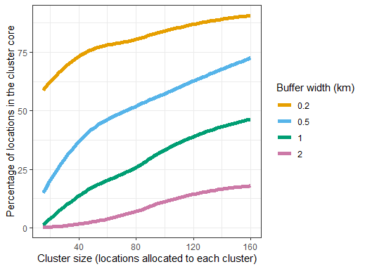
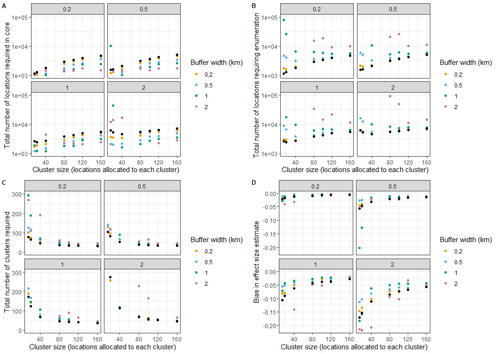

The standard formulae for power and sample size calculations for vector-control
CRTs can be extended to allow for spillover by incorporating a diffusion model
for mosquito movement ([Smith et al(2025)](https://doi.org/10.21203/rs.3.rs-5423058/v1)).
The calculations required for this are implemented in `CRTspat` from v1.3.2.

This vignette provides example calculations for a two-armed trial
where the outcome is the number of events per location (for other outcome types see the help information for `CRTpower()`).

These calculations entail specifying the usual parameters needed for power calculations
for a CRT, namely:

  + The significance level `alpha` (usually 0.05)
  + The `desiredPower` which is usually 0.8 or 0.9.
  + 'effect': the efficacy that the trial should be powered to detect
  + The anticipated event rate in the absence of intervention `yC` (events per location)
  + The anticipated between-cluster coefficient of variation, `cv_percent`. For malaria trials, a listing of measured values of this is provided by [Biggs et al(2025)](https://doi.org/10.1038/s41467-025-61502-w). Alternatively the intra-cluster coefficient (`ICC`) may be provided for some kinds of outcomes.
  + The size of clusters, in terms of the numbers of locations (`h`) per cluster.

The extension to allow for spillover needs information about the anticipated spatial pattern of the data, most
conveniently in the form of geolocations of points where data will be collected. It is not necessary to have locations for the entire study area. Calculations may be much faster if
they are carried out using geolocations from a sub-area, and are valid if this is representative of the whole.

To carry out the calculations in `CRTspat` the geolocations should be in Euclidean (x,y) coordinates with units in km, roughly centred around (0,0).
These are converted to a `CRTsp` object. If the original coordinates are in lat
long format, the `CRTspat::latlong_as_xy()` function can convert to the required format.

To invoke the diffusion model for spillover in `CRTspat::CRTpower()`:

  + `outcome_type = "d"` must be specified.
  + `spillover_interval` defined as the distance encompassing 95% of mosquito
  movement during the interval between potentially being faced with the
  intervention and measurement. Since movement is approximated with a
  bivariate normal kernel, the `spillover_interval` is approximately 4.9 times
  the mean absolute displacement of mosquitoes during one oviposition cycle
  ([Smith et al(2025)](https://doi.org/10.21203/rs.3.rs-5423058/v1)).
  + If a buffer zone is defined, with the intention that the main outcome data
  are collected only from the core area, then the width of the `buffer` is specified in km.

The following illustrates the calculations for an example dataset
(with 25 locations allocated to each cluster):


``` r
library(CRTspat)
library(dplyr)
set.seed(1234)
locations <- readdata("exampleCRT.txt")$trial[, c('x','y')]
CRT <- CRTsp(locations) %>%
       specify_clusters(h=25, algorithm="NN") %>%
       randomizeCRT(baselineDenominator="base_denom") %>%
       specify_buffer(buffer_width=0.5)
power <- CRTpower(CRT, desiredPower = 0.8, effect = 0.3, yC = 0.5, outcome_type = "n",
            cv_percent = 20, spillover_interval = 1.5)
summary(power)
```

```
## ===============================CLUSTER RANDOMISED TRIAL ===========================
## 
## Summary of coordinates
## ----------------------
##                Min.   : 1st Qu.: Median : Mean   : 3rd Qu.: Max.   :
##       x        -3.20    -1.39    -0.30    -0.07     1.25     5.16   
##       y        -5.07    -2.84     0.19     0.05     2.49     6.16   
## nearestDiscord -1.37    -0.30     0.01    -0.03     0.26     1.30   
## 
## Total area (within  0.2 km of a location) :  27.6 sq.km
## Total area (convex hull) :  48.2 sq.km
## 
## Locations and Clusters
## ----------------------                                          Full          Core
## Coordinate system                      (x, y)            
##                          
## Locations:                                                      1181          264
## Available clusters (across both arms)                           48          26
##   Per cluster mean number of points                             24.6          10.2
##   Per cluster s.d. number of points                             2.7          7.6
## Cluster randomization:                      Independently randomized            
## 
## Specification of Requirements
## -----------------------------          -            
## Significance level (2-sided):              0.05            
## Type of Outcome                             count            
## Expected outcome in control arm:            0.5            
## Mean rate multiplier:                       1            
## Required effect size:                       0.3            
## Coefficient of variation (%):               20            
## 
## Power calculations
## ------------------                              Full          Core
## Design effect:                                   1.5          1.2
## Spillover affecting 90.3% of data,
##   normal model gives bias estimate:          -0.122          -0.077
## Nominal power (%)                                43.3          37.2
## Total clusters required (power of 80%):          116          138
## Sufficient clusters for required power?          No          No
```

The output gives power calculations based on the geolocations
provided, and also indicates how large a trial needs to be if it is to have
the required power, even if this is larger than the area analysed.

A key issue in efficient CRT design is to optimise the size of the clusters. It is also
important to know whether there are advantages in specifying buffer zones, and if so,
how large these should be. These issues can be addressed by simulating an array of trials with
different sizes of clusters and of buffers. Since the spillover interval is likely to
be very uncertain, it is also relevant to examine the sensitivity of the required
size of trial to the spillover interval.


``` r
df <- data.frame(expand.grid(yC = c(0.5),
                  effect = c(0.3),
                  h = c(15, 20, 40, 80, 100, 120, 160),
                  cv_percent = c(30),
                  buffer = c(0.2, 0.5, 1.0, 2.0),
                  spillover_interval = c(0.2, 0.5, 1.0, 2.0),
                  replicate = seq(1:5)))
#df$total_pop_required <- df$core_pop_required <- NA
for(i in 1:nrow(df)){
 cat(i, '/', nrow(df), '\r')
 invisible(
  buffered <- specify_clusters(trial = CRT, h=df$h[i], algorithm="NN") %>%
             randomizeCRT(baselineDenominator="base_denom") %>%
             specify_buffer(buffer_width=df$buffer[i]))
  power <- with(df, CRTpower(
    trial = buffered,
    desiredPower = 0.8,
    effect = effect[i],
    yC = yC[i],
    outcome_type = "n",
    N = 1,
    cv_percent = cv_percent[i],
    spillover_interval = spillover_interval[i],
    distance_distribution = "normal"
  ))
 df$percent_incore[i] <- power$geom_core$locations/power$geom_full$locations * 100
 df$total_pop_required[i] <- power$geom_full$mean_h *
                                power$geom_full$clustersRequired
 df$core_pop_required[i] <- ifelse(df$percent_incore[i] > 0,
                                power$geom_core$mean_h *
                                  power$geom_core$clustersRequired, NA)
 df$total_clustersRequired[i] <- power$geom_full$clustersRequired
 df$core_clustersRequired[i] <- ifelse(df$percent_incore[i] > 0,
                                power$geom_core$clustersRequired, NA)

 df$full_bias[i] <- power$geom_full$delta
 df$core_bias[i] <- ifelse(df$percent_incore[i] > 0,
                                power$geom_core$delta, NA)
}
df_means <- df %>%
  group_by(yC, effect, h, cv_percent, buffer, spillover_interval) %>%
  summarize(core_pop_required = mean(core_pop_required, na.rm = TRUE),
            core_clustersRequired = mean(core_clustersRequired, na.rm = TRUE),
            core_bias = mean(core_bias, na.rm = TRUE),
            percent_incore = mean(percent_incore))
df_means$total_to_enumerate <-
        100*df_means$core_pop_required/df_means$percent_incore
df_overallmeans <- df %>%
  group_by(yC, effect, h, cv_percent, spillover_interval) %>%
  summarize(total_pop_required = mean(total_pop_required),
            total_clustersRequired = mean(total_clustersRequired),
            full_bias = mean(full_bias))
```

To plot the results of these calculations, first
create plotting functions


``` r
library(ggplot2)
cbPalette <- function(){
  c("#E69F00", "#56B4E9", "#009E73", "#CC79A7")}

facetplot <- function(df_means, df_overallmeans, y1, y2){
  df_means$y1 <- df_means[[y1]]
  df_overallmeans$y2 <- df_overallmeans[[y2]]
  plot <- ggplot(data= df_means, aes(x = h,y = y1, colour = factor(buffer))) +
    theme_bw() +
    geom_point() +
    scale_colour_manual(values=cbPalette(),name = 'Buffer width (km)') +
    labs(x = "Cluster size (locations allocated to each cluster)") +
    geom_point(data = df_overallmeans, aes(y = y2), colour = 'black') +
    facet_wrap(~ spillover_interval)
  return(plot)}
```

To generate the plots


``` r
Fig10_1 <- ggplot(data= df_means, aes(x = h,y = percent_incore, colour = factor(buffer))) +
  theme_bw() +
  geom_smooth(linewidth = 2, se = FALSE) +
  scale_colour_manual(values=cbPalette(), name = 'Buffer width (km)') +
  labs(x = "Cluster size (locations allocated to each cluster)",
       y = "Percentage of locations in the cluster core")
```

The results are presented with the total number of locations allocated to each cluster
on the horizontal axis. This total includes both core and buffer locations. With the
given example geography, the proportion of locations in the core is highly dependent
on the buffer width(Figure 10.1). With small clusters and wide buffers, almost the
almost the whole study area falls in buffers.

<p>
   <br>
  <em>Fig 10.1 Effects of spillover interval and proportion of locations in core</em>
</p>


``` r
p1 <- facetplot(df_means = df_means, df_overallmeans = df_overallmeans,
  y1 = "core_pop_required",
  y2 = "total_pop_required") +
scale_y_log10(name = "Total number of locations required in core",
                      limits = c(1e+03, 1e+05))

p2 <- facetplot(df_means = df_means, df_overallmeans = df_overallmeans,
  y1 = "total_to_enumerate",
  y2 = "total_pop_required") +
scale_y_log10(name = "Total number of locations requiring enumeration",
                      limits = c(1e+03, 1e+05))

p3 <- facetplot(df_means = df_means, df_overallmeans = df_overallmeans,
          y1 = "core_clustersRequired",
          y2 = "total_clustersRequired") +
  scale_y_continuous(name = "Total number of clusters required",
                      limits = c(0, 300))

p4 <- facetplot(df_means = df_means, df_overallmeans = df_overallmeans,
          y1 = "core_bias",
          y2 = "full_bias") +
  scale_y_continuous(name = "Bias in effect size estimate")

library(cowplot)
Fig10_2 <- plot_grid(p1, p2, p3, p4, labels = c('A', 'B', 'C', 'D'), label_size = 10, ncol = 2)
```
Figures 10.2A-D are each divided into 4 panels corresponding to different
values of the spillover interval. The noise in the results arises because of the
random cluster assignments and can be reduced by averaging over more simulations
(or using a larger set of locations).

Except in the case of the largest spillover interval
of 2km, the required number of locations in the core (Fig 10.2A) increases
with the size of the clusters (corresponding to a strong decrease in
the number of clusters needed (Figure 10.2C), while the number of
locations required in the core decreases with buffer width. These
large buffer zones must however be traded off against the very large total
numbers of locations needing enumerating in CRTs with large buffer zones (Figure 10.2B)

<p>
   <br>
  <em>Fig 10.2 Effects of spillover interval and buffer width on required sample size</em>
</p>

These considerations suggest that there is little advantage in increasing the
core size above a value of about 60 for this set of parameters. Above this
size the expected bias (Figure 10.2D) is modest, irrespective of
the buffer width, unless the spillover interval is very large or
clusters very small. It should be noted that a smaller number of locations are needed
in the core if more data is collected from each location. This
is equivalent to increasing the value of ´yC´ in these
simulations.


