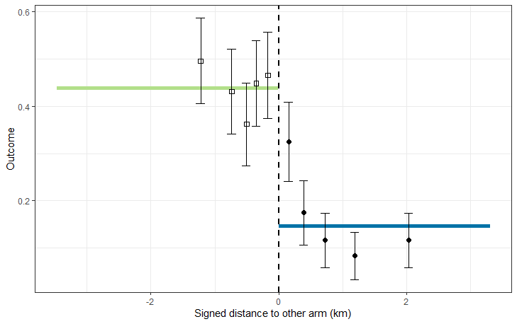

<!--To build the vignette
# since the vignette takes a long time to run, it is not run with every build
# as suggested here https://ropensci.org/blog/2019/12/08/precompute-vignettes/
# to Knit this vignette without this time consuming step being part of the default build
knitr::knit("vignettes/Usecase2.Rmd.orig", output = "vignettes/Usecase2.Rmd")
rmarkdown.html_vignette.check_title = FALSE
devtools::install(build_vignettes = TRUE)
-->
Effects of settlement patterns, choices of cluster size and buffer widths, and the extent of contamination between arms on the outcomes of CRTs do not lend themselves to mathematical analysis. Simulations of trials are used to explore the effects of these variables on trial power and on the robustness of statistical methodologies.

Trials can be simulated using the `simulateCRT` function, which augments a `trial` data frame (created externally) or object of class `CRTsp` (created by package functions) with simulated outcome data.  The input object must be given location information and both cluster and arm assignments (see [Use Case 1](Usecase1.html)) (or the package can
generate these if the objective is purely simulation.

Information about the underlying spatial pattern of disease is used in the form of the intra-cluster correlation of the outcome, which is input to the simulation as variable `ICC_inp`, and of the `propensity`. The former takes a single value for the chosen design. The latter takes a positive real value for each location. In the case of malaria, `propensity` can be thought of as measuring exposure to infectious mosquitoes.

`ICC_inp` and `propensity` may either be estimated from other datasets or supplied by the user. The behaviour of the
function depends on which variables are supplied, and the value of `generateBaseline`,  as follows:

| Data supplied by the user | Function behaviour |
|:-------------------|:--------------------------|
|`propensity` supplied by user|Baseline data are created by sampling around `propensity`|
|Baseline data are supplied by user and `propensity` is not supplied |`propensity` is created from the baseline data|
|Neither baseline data nor `propensity` are supplied |`propensity` is generated as a normal kernel, with the bandwidth adjusted to achieve the input value of the `ICC_inp` (after the further smoothing stage to simulate contamination)|

Contamination or spillover between trial arms is modelled as a additional smoothing process applied to the `propensity` via a normal kernel. In the case of malaria this is proposed as an approximation to the effect of mosquito movement. The degree of spillover is specified either as a contamination range with the `theta_inp` parameter, or as `sd`, the bandwidth of the corresponding normal kernel. If both are provided then it is the value of `theta_inp` that is used.

#### Example with baseline data provided as proportions

```r
library(CRTspat)
set.seed(1234)
example_locations <- readdata('example_site.csv')
example_locations$base_denom <- 1
library(dplyr)
example_randomized <- CRTsp(example_locations) %>%
  aggregateCRT(auxiliaries = c("RDT_test_result", "base_denom")) %>%
  specify_clusters(h = 50, algorithm = 'NN') %>%
  randomizeCRT(matchedPair = FALSE)
summary(example_randomized)
```

```
## ===============================CLUSTER RANDOMISED TRIAL ===========================
## 
## Summary of coordinates
## ----------------------
##         Min.   : 1st Qu.: Median : Mean   : 3rd Qu.: Max.   :
##       x -3.20    -1.40    -0.30    -0.07     1.26     5.16   
##       y -5.08    -2.84     0.19     0.05     2.49     6.16   
## Total area (within  0.2 km of a location) :  27.6 sq.km
## 
## Locations and Clusters
## ----------------------                                          -            
## Coordinate system                      (x, y)            
## Locations:                                                      1181            
## Available clusters (across both arms)                           24            
##   Per cluster mean number of points                             49.2            
##   Per cluster s.d. number of points                             3.9            
## S.D. of distance to nearest discordant location (km):           1.05          
## Cluster randomization:                      Independently randomized            
## No power calculations to report          -            
## 
## Other variables in dataset
## --------------------------          RDT_test_result  base_denom
```

```r
plotCRT(example_randomized, map = TRUE)
example2a <- simulateCRT(example_randomized,
       effect = 0.8,
       outcome0 = 0.5,
       generateBaseline = FALSE,
       baselineNumerator = "RDT_test_result",
       baselineDenominator = "base_denom",
       ICC_inp = NULL, theta_inp = 0.8)
```

```
## 
## =====================    SIMULATION OF CLUSTER RANDOMISED TRIAL    =================
```

```r
summary(example2a)
```

```
## ===============================CLUSTER RANDOMISED TRIAL ===========================
## 
## Summary of coordinates
## ----------------------
##         Min.   : 1st Qu.: Median : Mean   : 3rd Qu.: Max.   :
##       x -3.20    -1.40    -0.30    -0.07     1.26     5.16   
##       y -5.08    -2.84     0.19     0.05     2.49     6.16   
## Total area (within  0.2 km of a location) :  27.6 sq.km
## 
## Locations and Clusters
## ----------------------                                          -            
## Coordinate system                      (x, y)            
## Locations:                                                      1181            
## Available clusters (across both arms)                           24            
##   Per cluster mean number of points                             49.2            
##   Per cluster s.d. number of points                             3.9            
## S.D. of distance to nearest discordant location (km):           1.05          
## Cluster randomization:                      Independently randomized            
## No power calculations to report          -            
## 
## Other variables in dataset
## --------------------------          RDT_test_result  base_denom  propensity  denom  num
```

```r
library(Matrix)
examplemesh100 <- readdata("examplemesh100.txt")
example2aanalysis <- CRTanalysis(trial=example2a, method = 'T')
summary(example2aanalysis)
```

```
## =====================CLUSTER RANDOMISED TRIAL ANALYSIS =================
## Analysis method:  T 
## Link function:  logit 
## Model formula:  arm + (1 | cluster) 
## No modelling of contamination 
## Estimates:     Control:  0.364  (95% CL:  0.286 0.451 )
##           Intervention:  0.21  (95% CL:  0.147 0.292 )
##              Efficacy:   0.423  (95% CL:  0.208 0.727 )
## Percentage of population in contamination zone:  0 %
## P-value (2-sided):  0.006879
```

```r
example2aINLA <- CRTanalysis(trial=example2a,
                                 method = 'INLA', link='logit', cfunc = 'X',
                                 clusterEffects = TRUE,
                                 requireMesh = TRUE, inla_mesh = examplemesh100)
plotCRT(example2aINLA)
plotCRT(example2aINLA, map = TRUE, fill = 'prediction', showClusterBoundaries = TRUE)
```

<p>
     <br>
    <em>Fig 2.1 Map of simulated outcome at cluster level</em>
</p>

<p>
     <br>
    <em>Fig 2.2 Variation in outcome by distance from boundary</em>
</p>

#### Example with infectiousness proxy surface generated externally

```r
set.seed(1234)
# Simulate a site with 2000 locations
new_site <- CRTsp(geoscale = 2, locations=2000, kappa=3, mu=40)
# propensity surface generated as an arbitrary linear function of x the co-ordinate
new_site$propensity <- 0.5*new_site$trial$x - min(new_site$trial$x)+1
library(dplyr)
invisible(capture.output(
example2b<- CRTsp(new_site) %>%
   specify_clusters(h = 40, algorithm = 'NN') %>%
   randomizeCRT(matchedPair = FALSE) %>%
   simulateCRT(example_simulated,
                          effect = 0.8,
                          outcome0 = 0.5,
                          generateBaseline = TRUE,
                          ICC_inp = 0.05,
                          theta_inp = 0.5)
))
summary(example2b)
```

```
## ===============================CLUSTER RANDOMISED TRIAL ===========================
## 
## Summary of coordinates
## ----------------------
##         Min.   : 1st Qu.: Median : Mean   : 3rd Qu.: Max.   :
##       x -8.73    -5.16    -1.03     0.00     5.17    11.26   
##       y -9.55    -4.42    -0.58     0.00     4.56    10.45   
## Total area (within  0.2 km of a location) :  181 sq.km
## 
## Locations and Clusters
## ----------------------                                          -            
## Coordinate system                      (x, y)            
## Locations:                                                      2000            
## Available clusters (across both arms)                           50            
##   Per cluster mean number of points                             40            
##   Per cluster s.d. number of points                             0            
## S.D. of distance to nearest discordant location (km):           1.33          
## Cluster randomization:                      Independently randomized            
## No power calculations to report          -            
## 
## Other variables in dataset
## --------------------------          propensity  base_denom  base_num  denom  num
```

```r
results2b <- CRTanalysis(example2b, method = 'GEE')
summary(results2b)
```

```
## =====================CLUSTER RANDOMISED TRIAL ANALYSIS =================
## Analysis method:  GEE 
## Link function:  logit 
## Model formula:  arm 
## No modelling of contamination 
## Estimates:     Control:  0.372  (95% CL:  0.319 0.428 )
##           Intervention:  0.228  (95% CL:  0.192 0.269 )
##              Efficacy:   0.387  (95% CL:  0.233 0.511 )
## Percentage of population in contamination zone:  0 %
## Intracluster correlation (ICC):  0.0454  (95% CL:  0.0202 0.0706 )
```

```r
plotCRT(example2b, map = TRUE, fill = 'clusters', showClusterLabels = TRUE, maskbuffer = 0.5)
```
<p>
     <br>
    <em>Fig 2.3 Map of clusters in simulated trial</em>
</p>

#### Example with baseline generated from user-provided values of the overall initial prevalence and ICC

```r
set.seed(1234)
# use co-ordinates, cluster and arm assignments, and baseline data from `example_simulated`
invisible(capture.output(
example2c<- CRTsp(geoscale = 2, locations=2000, kappa=3, mu=40) %>%
   specify_clusters(h = 40, algorithm = 'NN') %>%
   randomizeCRT(matchedPair = FALSE) %>%
   simulateCRT(new_site,
       effect = 0.8,
       outcome0 = 0.5,
       generateBaseline = TRUE,
       baselineNumerator = 'base_num',
       baselineDenominator = 'base_denom',
       ICC_inp = 0.08,
       theta_inp = 0.2)
))
results2c <- CRTanalysis(example2c, method = 'GEE')
summary(results2c)
```

```
## =====================CLUSTER RANDOMISED TRIAL ANALYSIS =================
## Analysis method:  GEE 
## Link function:  logit 
## Model formula:  arm 
## No modelling of contamination 
## Estimates:     Control:  0.317  (95% CL:  0.26 0.381 )
##           Intervention:  0.283  (95% CL:  0.23 0.343 )
##              Efficacy:   0.107  (95% CL:  -0.184 0.317 )
## Percentage of population in contamination zone:  0 %
## Intracluster correlation (ICC):  0.0834  (95% CL:  0.0503 0.117 )
```
