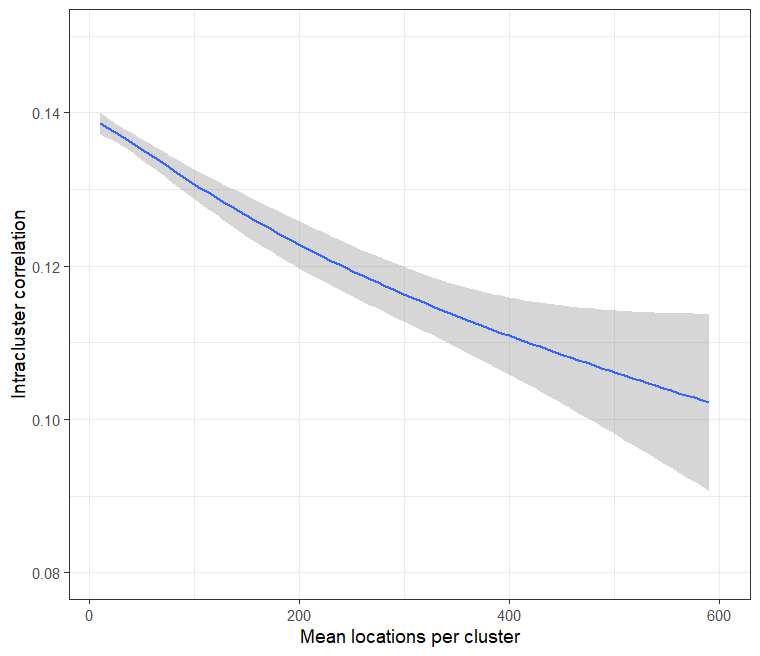

<!--To build the vignette
# since the vignette takes a long time to run, it is not run with every build
# as suggested here https://ropensci.org/blog/2019/12/08/precompute-vignettes/
# to Knit this vignette without this time consuming step being part of the default build
knitr::knit("vignettes/Usecase3.Rmd.orig", output = "vignettes/Usecase3.Rmd")
rmarkdown.html_vignette.check_title = FALSE
devtools::install(build_vignettes = TRUE)
-->

The Intracluster Correlation Coefficient (ICC) is one of the inputs to standard power and sample size calculations for CRTs. Trialists often have difficulty identifying an appropriate source for their
ICC calculations, or use a value from a source of questionable relevance.

The [`CRTanalysis`](../reference/CRTanalysis.html) function has an option to use Generalised Estimating Equations, which provide an estimate of the ICC. This can be applied to baseline data, and hence to different cluster configurations. This makes it possible to estimate the ICC which is appropriate for any given cluster definition, in the chosen geography, assuming baseline data are available.


```r
# use the same dataset as for Use Case 1.
library(CRTspat)
example_locations <- readdata("example_baseline.csv")
example_locations$base_denom <- 1
library(dplyr)
example <- latlong_as_xy(example_locations) %>%
    aggregateCRT(auxiliaries = c("RDT_test_result", "base_denom"))
summary(example)
```

```
## ===============================CLUSTER RANDOMISED TRIAL ===========================
## 
## Summary of coordinates
## ----------------------
##         Min.   : 1st Qu.: Median : Mean   : 3rd Qu.: Max.   :
##       x -6.29    -2.58    -0.19    -0.06     2.80     5.43   
##       y -3.08    -1.17    -0.43    -0.07     1.10     4.77   
## Total area (within  0.2 km of a location) :  27.6 sq.km
## 
## Locations and Clusters
## ----------------------                                          -            
## Coordinate system                      (x, y)            
## Locations:                                                      1181            
## Available clusters (across both arms)                           Not assigned            
## Cluster randomization:                      Independently randomized            
## No power calculations to report          -            
## 
## Other variables in dataset
## --------------------------          RDT_test_result  base_denom
```

```r
# randomly sample an array of values of k (use a small sample size for testing
# the plots were produced with n=5000)
set.seed(5)
k_vec <- round(runif(20, min = 6, max = 150))

# a user function randomizes and analyses each simulated trial
CRTscenario3 <- function(k, CRT) {
    ex <- specify_clusters(CRT, k = k, algo = "kmeans") %>%
        randomizeCRT()
    invisible(capture.output(
      GEEanalysis <- CRTanalysis(ex, method = "GEE", baselineOnly = TRUE, excludeBuffer = FALSE,
          baselineNumerator = "RDT_test_result", baselineDenominator = "base_denom")
    ))
    locations <- GEEanalysis$description$locations
    ICC <- GEEanalysis$pt_ests$ICC
    value <- c(k = k, ICC = ICC, mean_h = locations/k)
    return(value)
}

# The results are collected in a data frame
results <- t(sapply(k_vec, FUN = CRTscenario3, simplify = "array", CRT = example)) %>%
    data.frame()
```

There is a clear downward trend in the ICC estimates, as cluster size increases (Figure 3.1). The ICC for a trial
in this, or similar, geographies can be read off the curve. Note that the ICC is expected to vary
not just with cluster size, but also to vary between different outcomes.


```r
library(ggplot2)
theme_set(theme_bw(base_size = 14))
ggplot(data = results, aes(x = mean_h, y = ICC)) + geom_smooth() +
  xlab("Mean locations per cluster") + ylab("Intracluster correlation") +
  ylim(0.08, 0.15) + xlim(10, 600)
```

```
## `geom_smooth()` using method = 'loess' and formula = 'y ~ x'
```

```
## Warning: Removed 13 rows containing non-finite values (`stat_smooth()`).
```

```
## Warning in max(ids, na.rm = TRUE): no non-missing arguments to max; returning -Inf
```
<p>
     <br>
    <em>Fig 3.1 Intracluster correlation by size of cluster</em>
</p>


